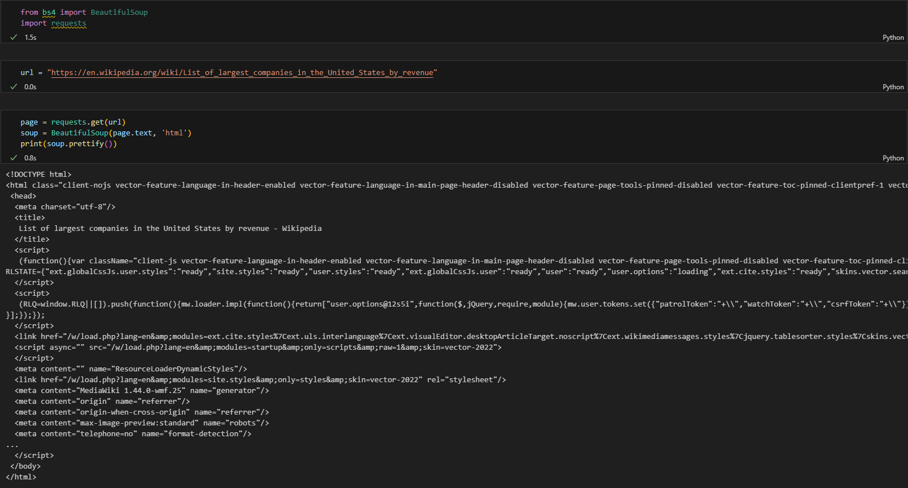
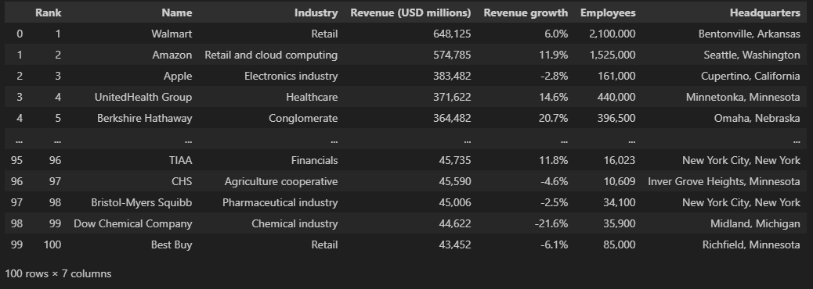

# 🌐 Web Scraping with Python and BeautifulSoup

---

## 📝 Summary

This project demonstrates how to perform **web scraping** using Python with the `requests` and `BeautifulSoup` libraries. The goal was to extract useful data from a website and process it into a structured format like a table or CSV file. It was built entirely in a Jupyter Notebook, making it easy to follow step-by-step.

---

## 🔧 What I Did

- Imported and used `requests` to fetch web content
- Parsed the HTML content using `BeautifulSoup`
- Extracted specific elements from the webpage (e.g. titles, prices, links, etc.)
- Stored the scraped data into a **Pandas DataFrame**
- Exported the final data to a **CSV file**

---

## 📚 What I Learned

- How web pages are structured using HTML and how to navigate the DOM
- How to extract specific data using `BeautifulSoup` methods like `.find()` and `.find_all()`
- How to clean and organize scraped data
- How to handle common scraping challenges like missing tags or inconsistent formatting

---

## ✅ Result

The notebook successfully scrapes data from the target website and organizes it into a well-structured table that can be saved or further analyzed. It serves as a beginner-level example of real-world data extraction.

---

## 🌄 Screenshots

### 🔍 HTML Parsing in Action

### 📋 Final Extracted DataFrame

---

## 🌱 Future Improvements

- Add exception handling to manage request failures
- Automate scraping for multiple pages or categories
- Schedule regular scraping with `cron` or `schedule`
- Visualize scraped data using `matplotlib` or `seaborn`
- Deploy as a Streamlit or Flask mini web app

